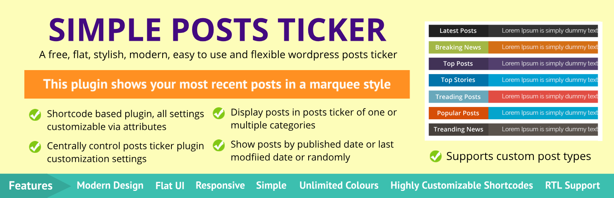

# Simple Posts Ticker

The Simple Posts Ticker plugin is a small tool that shows your most recent posts in a marquee style.

 

## Description

The Simple Posts Ticker plugin brings a lightweight, flexible and easy way to configure news ticker plugin to WordPress website. This plugin adds scrolling horizontal posts tickers to your site. It can be use as shortcode or PHP codes. You can customize every setting of this plugin in the admin dashboard.

### Advantages of this plugin

* Lightweight jQuery.
* CSS Ticker Animation.
* Easy to configuration.
* Multi Post Support.
* Full RTL Support.
* Custom Post Types support.
* Select post by date/modified date or randomly.
* Select posts by their category.
* Option to show a label before ticker.
* Option to customize all and everything.
* Supports localization.

Like Simple Posts Ticker plugin? Consider leaving a [5 star review](https://wordpress.org/support/plugin/simple-posts-ticker/reviews/?rate=5#new-post).

### Shortcode instructions

Using default settings: **[spt-posts-ticker]**

You can use some attributes to override the original settings. Please see plugin settings for detailed shortcode attributes.

#### Compatibility

* This plugin is fully compatible with WordPress Version 4.6 and beyond and also compatible with any WordPress theme.

#### Support

* Community support via the [support forums](https://wordpress.org/support/plugin/simple-posts-ticker) at WordPress.org.

#### Contribute
* Active development of this plugin is handled [on GitHub](https://github.com/iamsayan/simple-posts-ticker).
* Feel free to [fork the project on GitHub](https://github.com/iamsayan/simple-posts-ticker) and submit your contributions via pull request.

## Installation

### From within WordPress
1. Visit 'Plugins > Add New'.
1. Search for 'Simple Posts Ticker'.
1. Activate WP Last Modified Info from your Plugins page.
1. Go to "after activation" below.

### Manually
1. Upload the `simple-posts-ticker` folder to the `/wp-content/plugins/` directory.
1. Activate Simple Posts Ticker plugin through the 'Plugins' menu in WordPress.
1. Go to "after activation" below.

### After activation
1. After activation go to 'Settings > Simple Posts Ticker'.
1. Enable/disable options and save changes.

### Frequently Asked Questions

#### How to add this to your site?

If you want to add this somewhere else on your site, like header, footer, sidebar, etc, then probably the easiest way is to go to Appearance, Widgets, and place a text widget somewhere in your layout, and use the shortcode in that.

#### Is this plugin support custom post types?

Yes. this plugin automatically detects all custom post types and shows all of them as a drop down in plugin settings. You need to just select it from plugin settings.

## Changelog ##
[View Changelog](CHANGELOG.md)